# Continuous Integration/Continuous Deployment
In this section, we will check some of the most famous CI platforms/tools in the market to automatically deploy our application in the cloud. The chosen ones are Travis, JFrog (former Shippable), Circle CI and GitHub Actions. We think that Azure Pipelines may be an interesting candidate for this investigation, but since the project is open source and we try to mantain the cost to a minimum level, we have discarted this candidate.

## Travis CI
[Travis CI](https://www.travis-ci.com/) was created for open source projects. Its main focus is on improving the performance of the CI process, such as build, automated tests and deploy. It supports GitHub and GitLab among others repository services.

Its main features are:
1. Easy integration with GitHub.
2. Auto deployments after passing the pipeline
3. Clean machines for every build
4. Support Linux

## JFrog (former Shippable)
[JFrog](https://jfrog.com/tra) is a company focus on facilitate the nightmare of every programmer, the DevOps part. It main goals are the speed, the quality and the security. It works with all major software technologies. It is composed by five modules that cover more than we need:
1. JFrog Artifactory. This module supports package management.
2. JFrog Xray. This module main function is to secure the code and all the artifacts generated in the deployment process.
3. JFrog Pipelines. Upgrade your pipeline process with this module.
4. JFrog Distribution. Power the delivery process of every single software all the way to the customer.
5. JFrog Connect. This module enables software deployment to Edge and IoT devices under adverse circumstances, such as bad connectivity.

## Circle CI
[Circle CI](https://circleci.com/) claims to be industry-leading speed. It connects with almost every cloud service and it is one of the most used platform. It focuses on speed the deployment by having fast builds, premium support  and unmatched security.

## GitHub Actions
[GitHub Actions]() facilitates the automation of software workflows. It builds, it tests and it deploys from the GitHub repository. One of the advantages of using GitHub actions in our project, is that we have already tested some of the GitHub Actions functionality and that our code would be stored next to our "pipeline", so there is no need to communicate or integrate any other tool (as Docker Hub automated process).

## Conclusions
*Circle CI* seems to be one of the best candidates to be selected for this project. It facilitate the integration with almost every cloud service and it is widely used, with a big community.

Another potential candidate is *GitHub Actions*. It is in the same domain as the project repository, so there should be less latency between the automation process and the commits. We know that the latency may be miliseconds or seconds between GitHub and other CI platform, but having the code and the pipeline in the same domain makes it easier to handle (less log ins, less platforms, less trouble in case of a failure).

*Travis CI* is other of the best candidates. Travis CI is pretty similar to Circle CI, but it offers support to Linux environments too. Additionally, Travis is focus on open source projects, like this one.

Finally, we have chosen *Travis CI* and *GitHub Actions*, since we need to support Linux images and our project is open source. We think that it is worth to invest in learning GitHub Actions. We will know how to work with GitHub Actions, which is a little bit different than Travis or Circle CI, and we will know a new different process that may be useful in future developments. JFrog and Circle CI are similar to Travis CI, so we can discard them for Travis CI.

# Travis CI
To integrate Travis CI into GitHub, we just need to do some simple steps.
1. Login to Travis as GitHub. 
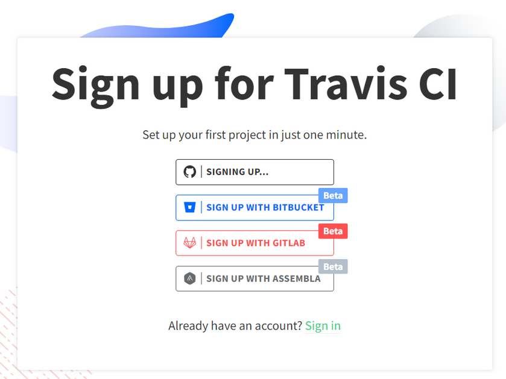
2. Authorize Travis permissions to GitHub clicking on "Authorize Travis CI".
3. Follow the [tutorial](https://app.travis-ci.com/getting_started) given by Travis.
4. Approve and install Travis CI in GitHub.

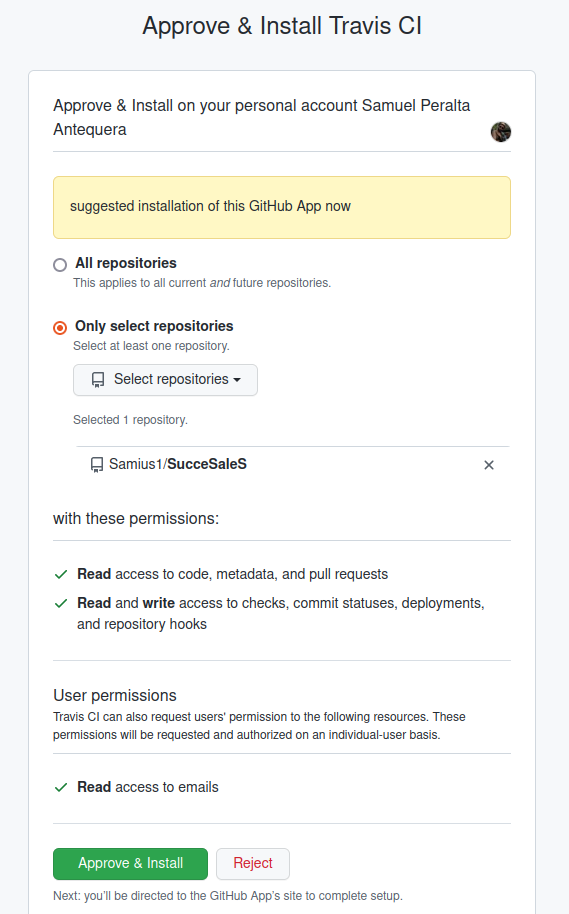
5. Check that the application is integrated in GitHub. 
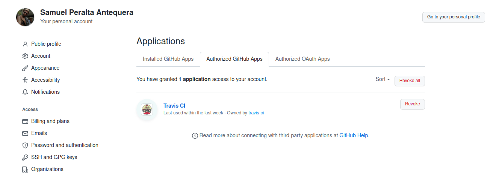
6. Create a Free plan in Travis. There is no image of the data being filled since it is sensitive information.
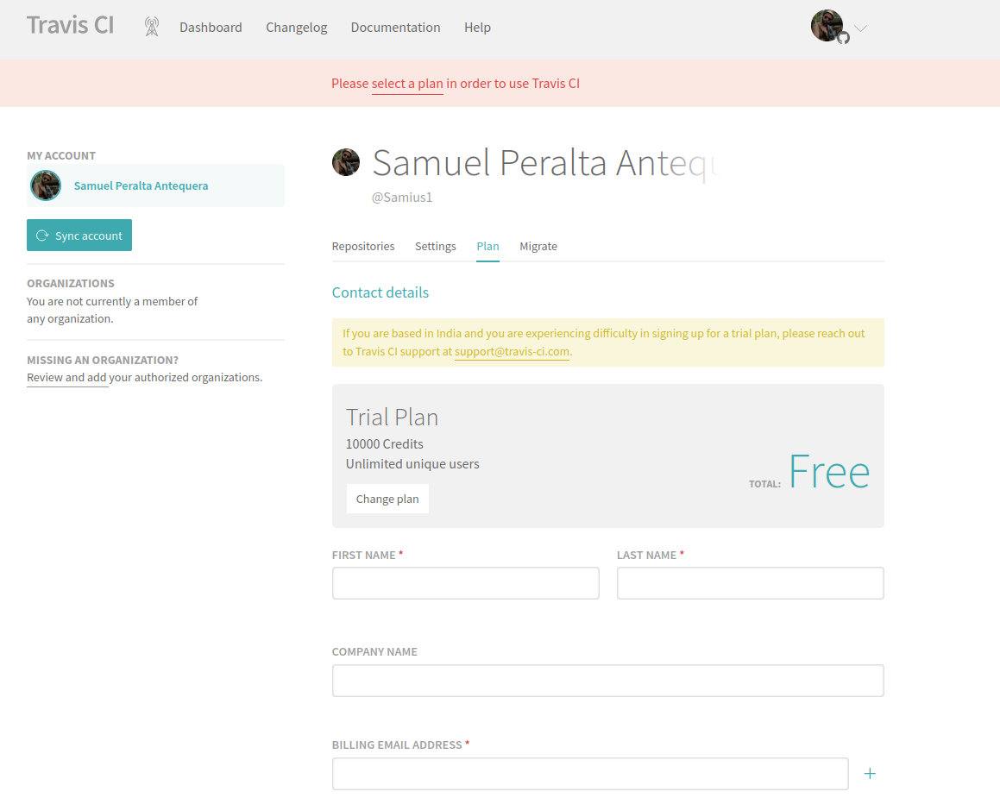
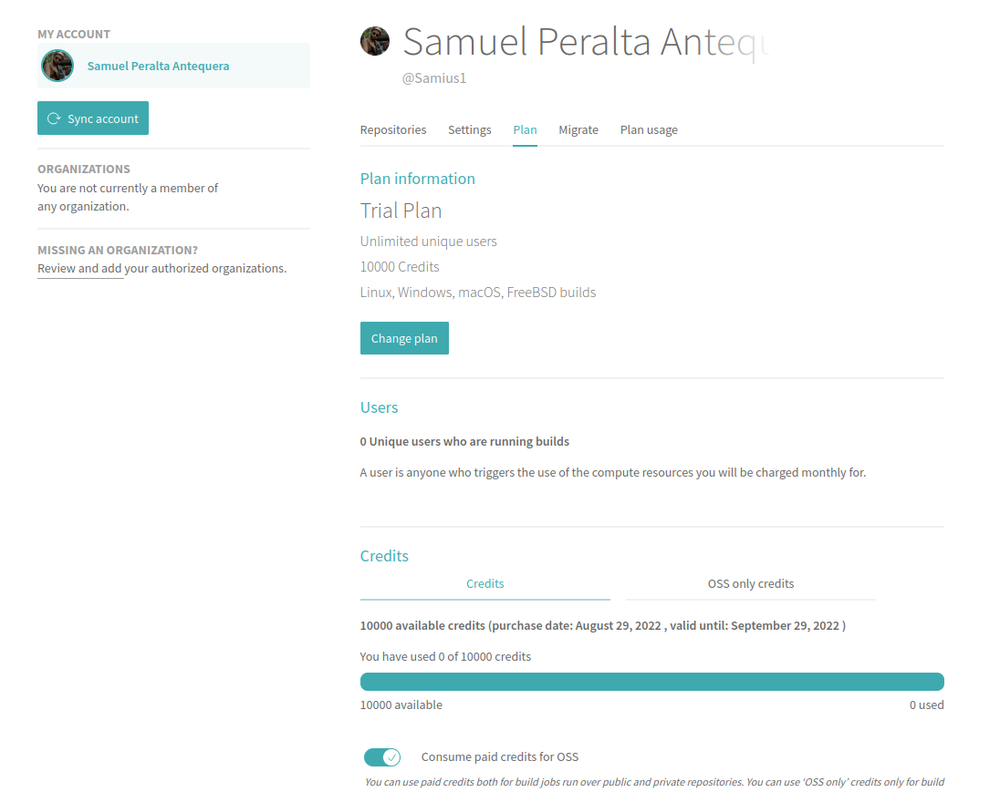
7. Create a ".travis.yaml" file with the necessary information and push it to GitHub.
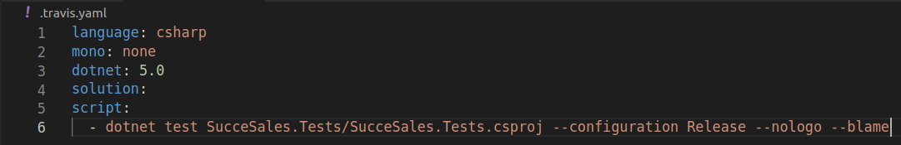
8. Now we can go to Travis and check that it has run and passed in green.
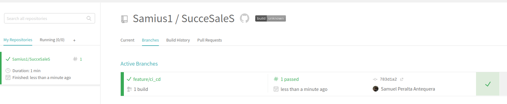

The next step is to dockerize the image and upload to the expected environments. Since we will use GitHub Actions, we will upload the image to Docker Hub with Travis CI and we will upload the image to GitHub Container Registry with GitHub Actions. 

In order to upload the image to Docker Hub, we need to set the user and password of Docker Hub in Travis.
To do that, we just go to the repository and then open "Settings" in the "More options" menu at the top right side of the screen.
Then, we add both variables in the "Environment Variables" section and the configuration will be done.
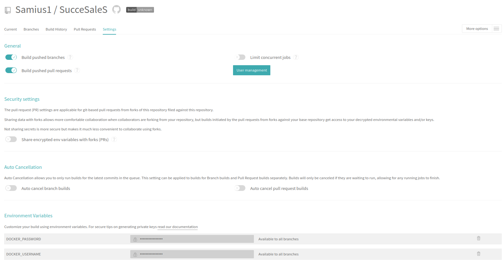
*Note: Remember to escape any [special character](https://tldp.org/LDP/abs/html/special-chars.html) that you use in your Travis environment variables.

After that, we need to modify the .travis.yaml file to upload the image to Docker Hub after the tests pass.
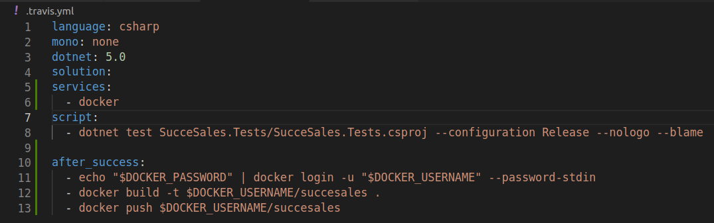

If we go to Docker Hub, we will see that the new image is uploaded after [Travis build](https://app.travis-ci.com/github/Samius1/SucceSaleS/builds/255042717) is done.
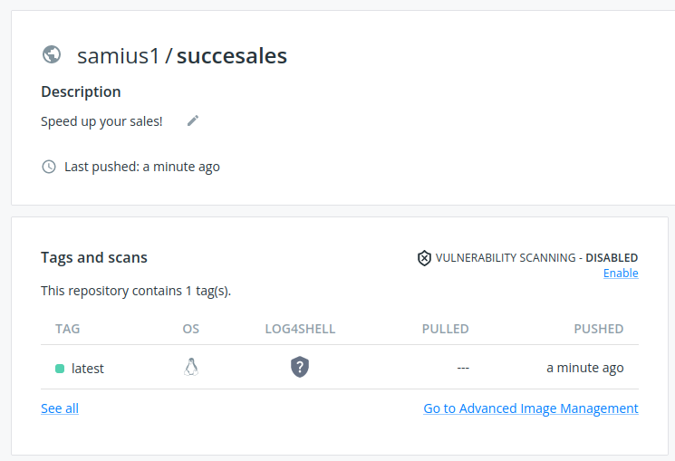

# GitHub Actions
Since GitHub Actions shares domain with GitHub, we don't need to add any new integration. In this case, we are going to upload the image to the GitHub Container Registry, so each system will have their own integration.

To do that, we had already implemented the workflow in the last milestone. In this one, we will update it to execute the tests before uploading the image to the registry.
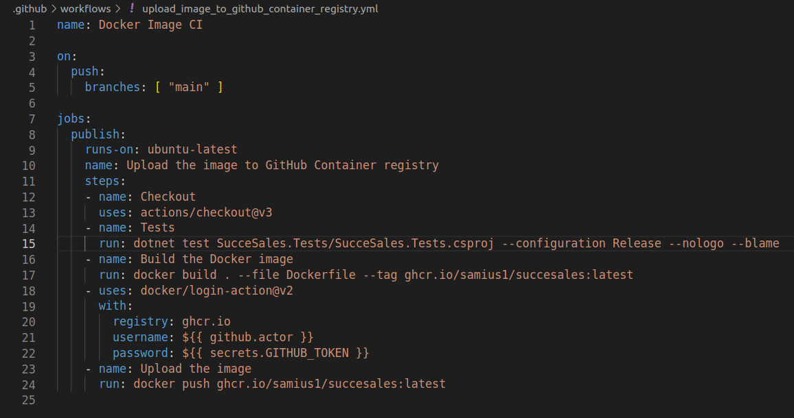

After that, when we commit the change to the main branch, the tests are executed and if they pass, the image is automatically uploaded in GitHub Container Registry.
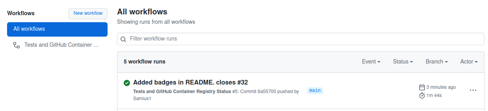
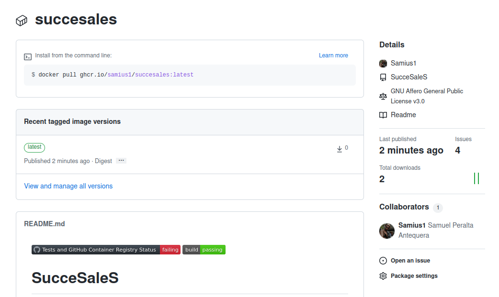

# Additional notes
After all the integrations are in place, we can see that Travis and GitHub Actions are executed when our pipelines run.
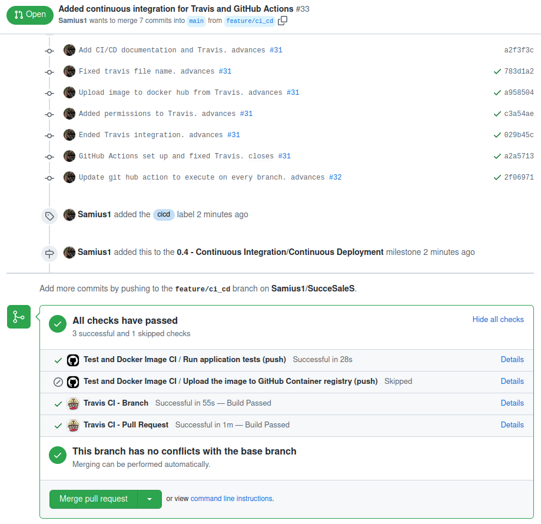

## Build stage
Someone may wonder why we are not using any build stage explicitly. In every usual cloud deployment workflow, the first step is "build the app". In .NET, we do a little improvement by skipping this step. Why do we skip it? Because when we execute the command "dotnet test ...", the first step it does is to compile the app. So if the compilation fails, it will fail before the tests are executed, as in every other language. 
So when we execute the tests in .NET, we are compiling implicitly.

## Project status after the continuous integration part
I'm pretty happy with the actual status of the project.
The application may not have that much logic, but I have been working with multiple .NET projects and, the more advanced the project was, the harder it was to upload it to the cloud. Right now, we are not using Terraform or Helm to deploy it, but if we had a bigger application, it would be pretty difficult to do what we have done in this milestone.

If I may have a word for the generations to come, I recommend you to do your project this way if you find hard to develop the application while "clouding" it. You will learn a lot about the cloudbecause you will be able to focus on learning it.

## External course repository pipeline
While executing the external course repository, we have found two different errors.
One was fixed as the stages in our project were different from the ones expected in the external course pipeline.

The other one has been impossible to revolve. It states that it is not possible to execute the following sentence within our image.
    docker run -t -v `pwd`:/app/test samius1/succesales:latest sh -c "ls && ./build.sh build && ./build.sh install && ./build.sh test"

It fails because it can not find the project file,as you can see in the following image, but the "Switch:" part, which usually gives a meaningful error like the name of the project file, just says "sh". So it seems like it is related with executing the sh in the docker, maybe the path changes because the data is moved to the /app/test folder.
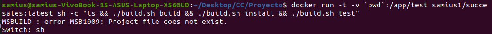

When you execute both command separated, they work just fine, so we finally moved to add logic to our application, since it seems like an external issue, which would be managed with Infraestructure team in a real environment.
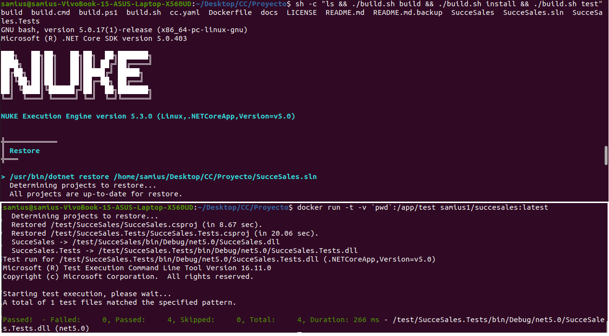

