# Docker
In this section, we will document the decisions related with the dockerize of our tests and application. The first step is the selection of the images we are going to try. In this case, we select ubuntu 20.04 and alpine 3.15 as an initial approach, and later on, we will try the image Windows offers.

Since our project uses .Net 5.0, we need some basic dependencias as the .NET runtime and SDK, so we will install them whenever we need it. The minimum amount of space required is about 400 MB, as you can see.

## [Ubuntu 20.04 Image](dockers/ubuntu.20.04.dockerfile)
We started using a default ubuntu image. In this case, we selected the 20.04 one because it's the one being used in the development laptop.

Since it was the first image, we faced tons of issues in order to run the tests. The first one was that Nuke was not installing properly the .NET environment, so we had to add a RUN command to install everything. First, we installed "wget" to be able to download the file that contains the information to find the dotnet repositories with apt. The, we just added the sentences to download it. In this first image, we tried to move up and down some layers (like "WORKDIR" and "COPY"). Also, we tried to copy just the expected files.   

Finally, we dismissed those last change for a few reasons. 
- The size of the image is so big that adding a few megabytes is negligible.
- The time recompiling the layers changed a little bit, but changing the workdir leads to some wrong paths and copying first the project will lead in the future to recompile the following layers, even though right now it's not happening (because we are not modifying the code).

## [Alpine 3.15 Image](dockers/alpine.3.15.dockerfile)
This alpine image has practically nothing installed with it, so it is a nice start point to research after the ubuntu image results. After a few trials and errors creating the needed environment, reading [the documentation](https://docs.microsoft.com/en-gb/dotnet/core/install/linux-scripted-manual) shows that we need to make sure that some dependencies are installed, like "libstdc++6". Since our task manager (Nuke) takes care of the installation of the .NET environment, we need to make sure that everything is in place. Since Nuke uses cURL to download some files, we add the dependency to the RUN sentence and we just execute the image.

Finally, we have our image created with a size of 1.64Gb as you can see in the next image. 

As you can see, it's a little bit smaller than the ubuntu one as expected.

## [DotNet 5.0 Image](dockers/dotnet.sdk5.0.dockerfile)
This image is the one created and mantained by Microsoft. As a result, it contains by default all the dependencies that this project needs. Furthermore, the default configuration is enough for Nuke to work, so it skips the installation of the .NET environment. As a result, this image is the most compacted one.

## Conclusions
From the very beginning, the DotNet image is the one which seems to be the best for this project. It is literally created by Microsoft, which develops and maintains C#, and it contains everything .NET needs to run. But I hoped to be able to create a similar image from scratch similar to the DotNet one, to have more control over the layers. 

After every try and error, and tons of trials, I have to admit that the DotNet image is the best fit for this project and, consequently, the one chosen.

## Side notes related with images
As we said in the above paragraph, the initial intention was to be able to create a custom image from scratch and have control over the layers and its order. For this specific reason, the first attempt was to create an image from scratch.

As expected, this image was pretty small but it was really hard to make it work. [The documentation](https://hub.docker.com/_/scratch) states that this image should be use just as base for debian images or for single binaries and its dependencies, which is not the case of this project. Additionally, we checked that the [ubuntu image chosen](https://github.com/tianon/docker-brew-ubuntu-core/blob/570d5970a8b18bc772ad2c3eb1ce8fd0887d991a/focal/Dockerfile) to investigate is just a scratch image with ubuntu, so we consider that the alpine image and that one are enough for the scope of this project and could show similar results at the end.

# Docker Hub
In this section, we will describe the steps to upload the image to Docker Hub. We are going to skip the login steps since they are pretty similar to all the online platforms. Our name was not taken so we could just create our account with our GitHub nickname.

So the first step to upload our container will be to create a new public repository with the name of our project as you can see in the image below.

When the repository is created, it's time to go to our local machine and log in to Docker Hub from the console with this command.
    
    docker login -u samius1 -p <password>

After the log in is successful, there is only one command left to upload the image to Docker Hub.

    docker push samius1/succesales:latest

Finally, if you go to the repository page, there will be a new image uploaded with the tag you selected.

# Automated Builds
In this section we will describe how we configured the automated builds in Docker Hub and GitHub Container Registry.

## Docker Hub
Now that we have our image on Docker Hub, the next step is setting up Docker Hub to be trigger and create a new image automatically when we push a change to our *main* branch. You can set up any branch to trigger this automated process, but we will only use main for simplicity.

So we go to "Builds" inside our Docker Hub repository and we select to link it with Git Hub. 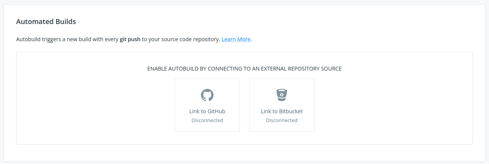

Now we have to link our GitHub account with Docker Hub, so we select "Link provider". 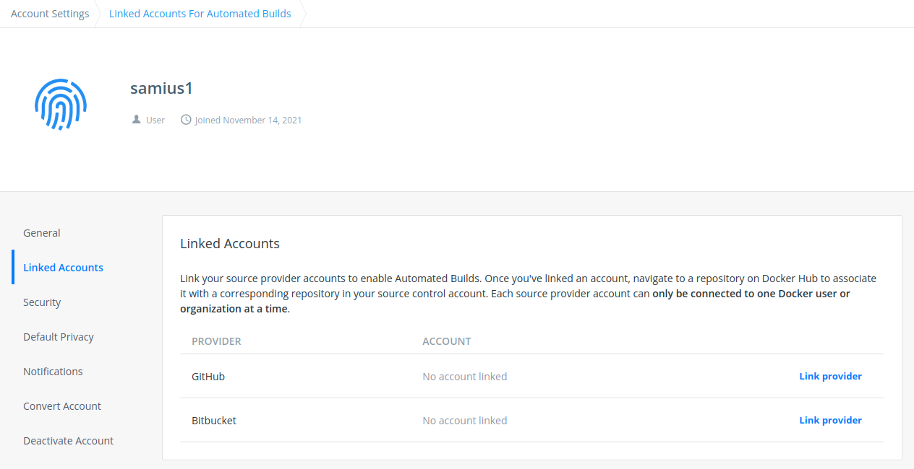

Docker Hub will ask for authorization in our GitHub account, so we will have to authorize it. 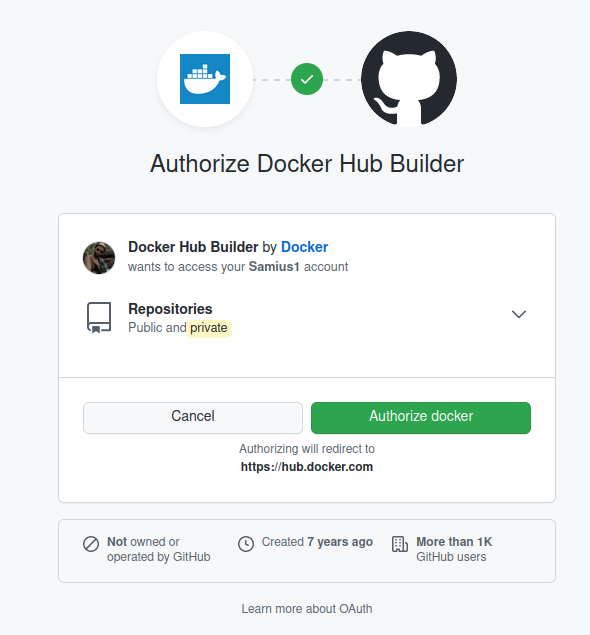 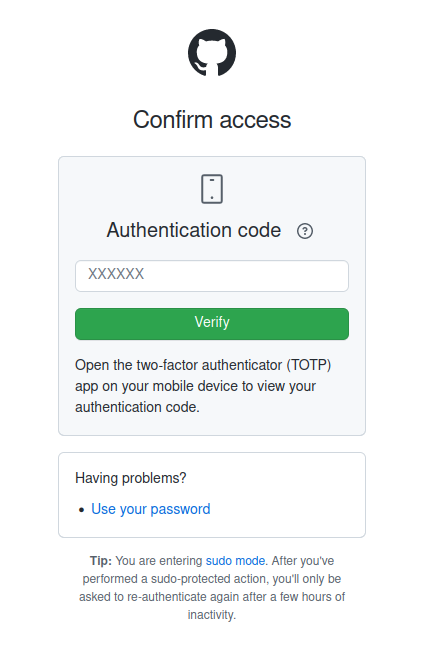

After that, we will have our accounts linked and now we can continue to configure the automated builds. 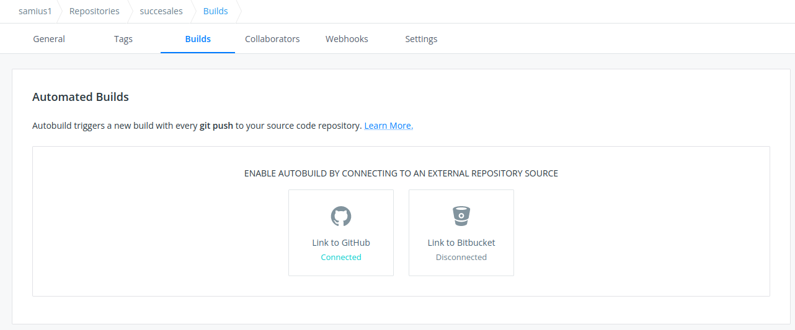

Since this is the first configuration, we will just use the default configuration that Docker Hub provides. Later on, we will modify it accordingly to the needs of the project.
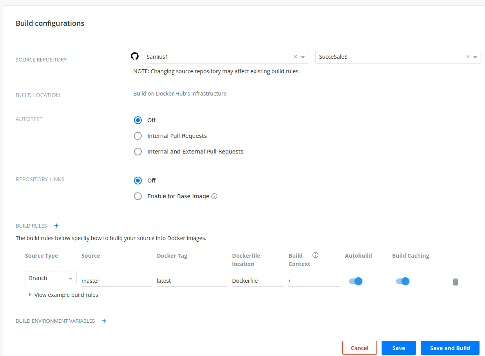

Finally, we have our project sets and we can see it in the "Builds" tab, where it is shown the information related with the automated builds activity.
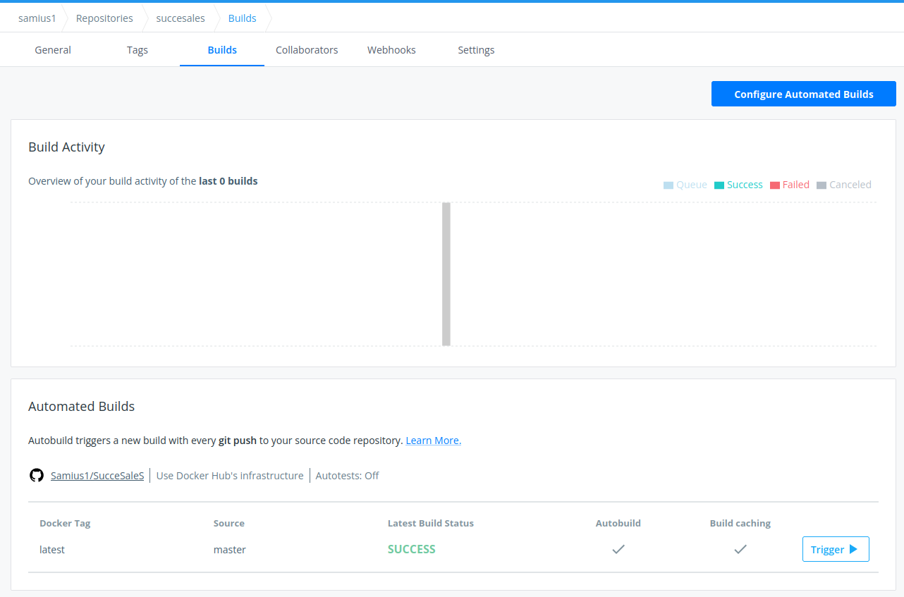

## GitHub Container Registry
As we did with Docker Hub, the firt step is going to add the image to GitHub. Since we were logged in Docker Hub, we need to do log in to GitHub. Remember to use a token, not the GitHub password.
    
    docker login ghcr.io -u "Samius1" --password-stdin

After the log in is successful, we just need to upload the image to GitHub with the usual command.

    docker push ghcr.io/samius1/succesales:latest

To see the new image upload, we have to go to the "Packages" tab in our GitHub profile page. 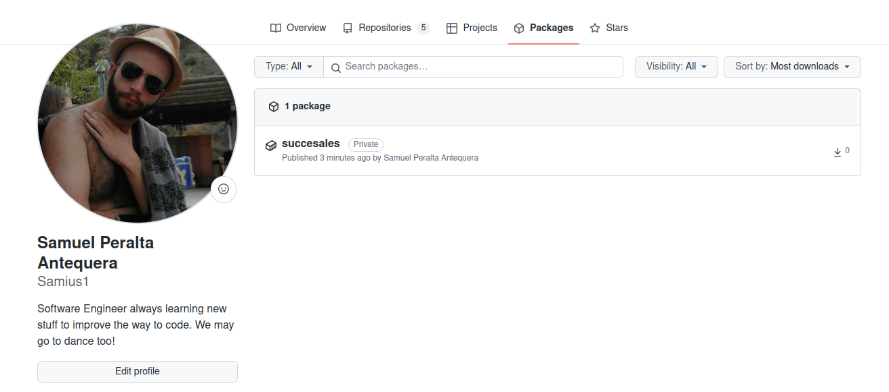

As you can see in the image above, the initial package is uploaded as "private", so we are going to change it to "public" in order to be able to use the command specified in the documentation of the subject but pointing to GitHub instead of Docker Hub.

    docker run -t -v `pwd`:/app/test ghcr.io/samius1/succesales:latest

Go to the "Danger zone" section in the "Settings" of the project and just set it as public there.
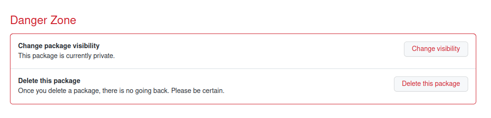
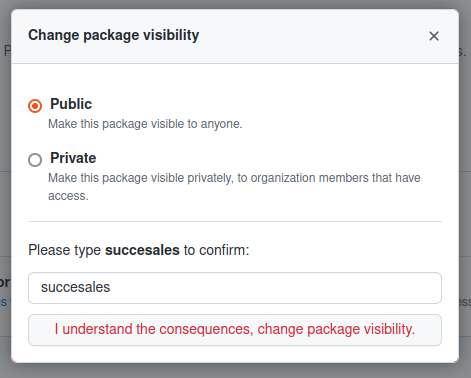

After that, we can execute the command for our local console and see that it is working as expected.
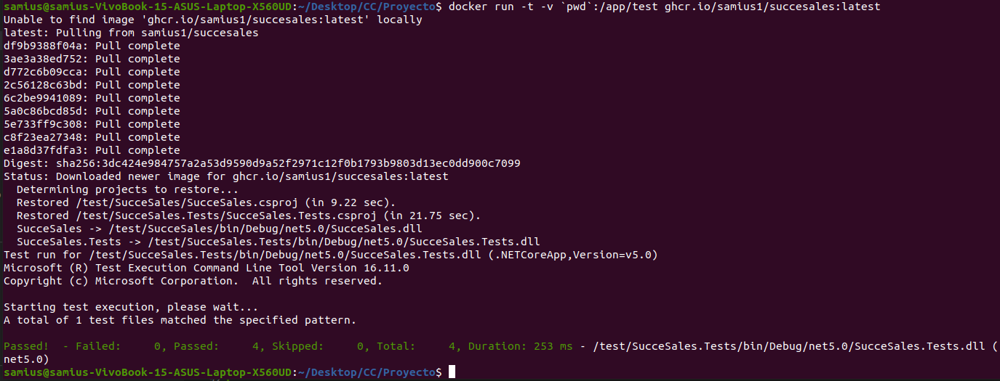

Now, we need to link the image to our repository in order to be able to see the readme from the package and to see the package from the repository, since it is not linked by default. As you can see in the below picture, you can do it manually or by adding a line in the dockerfile. Since this is done just once, we are going to do it manually.
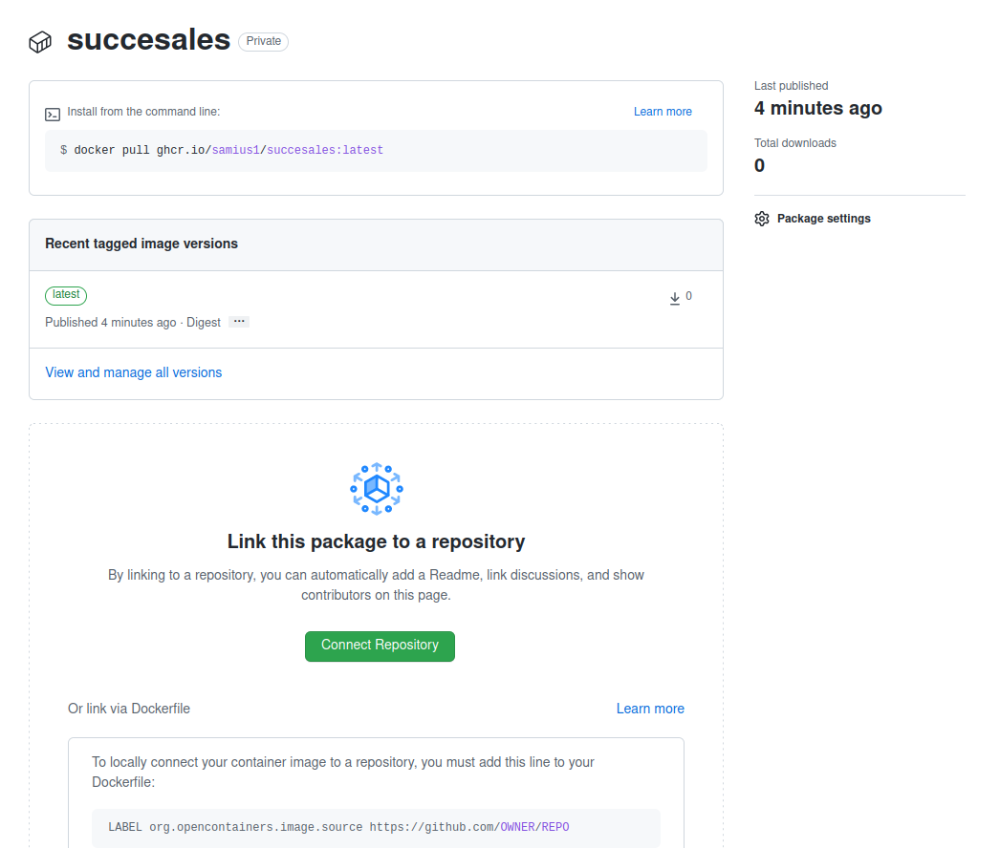

After that, we can check in our repository that we have the link to the package.
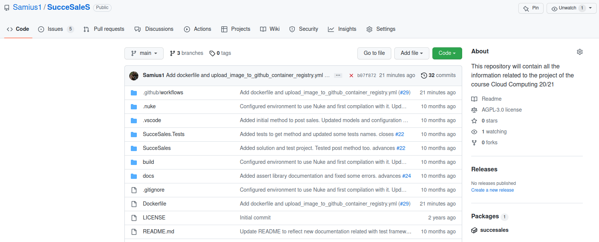
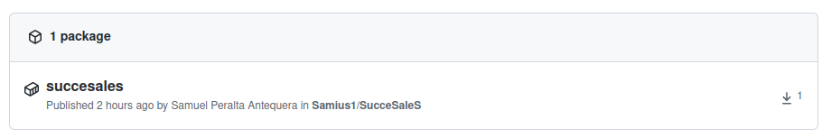

To be able to use GitHub actions in our package, we need to give permissions to it, as by default it has no write permission, even though we just linked it. So go to the settings section of the package and add the "Write" role/permission to our project.
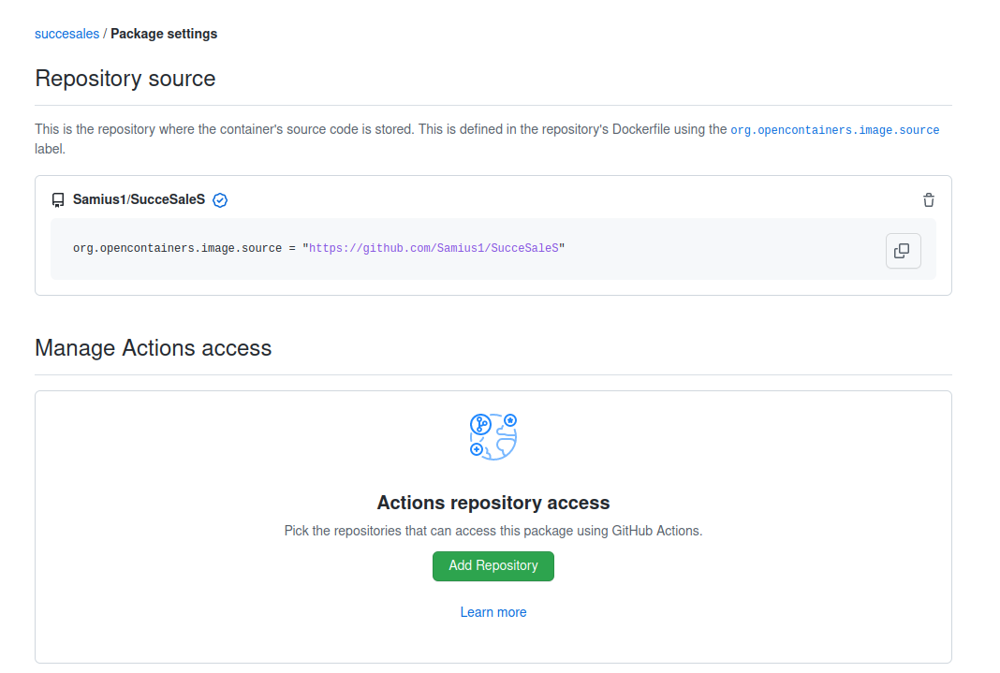
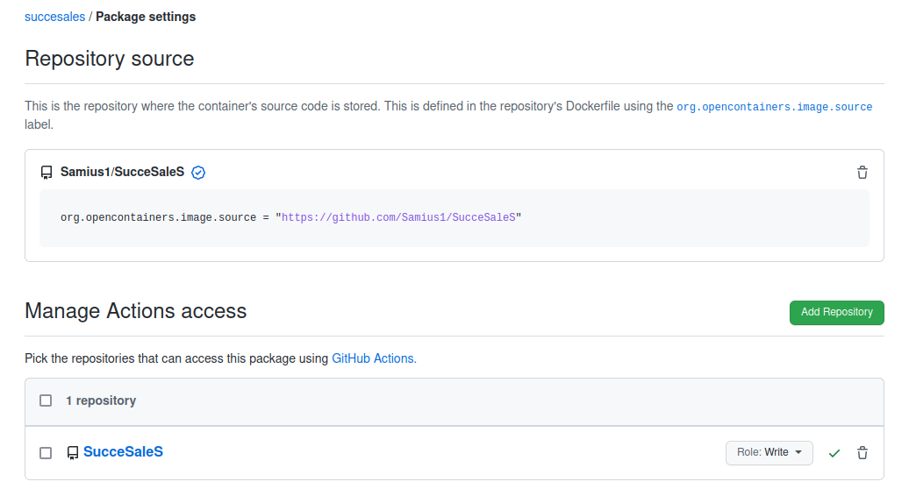

Now we can move onto the next topic, creating a GitHub action to upload new images automatically on every commit to GitHub Container Registry. To do so, we need to create an Action in our repository. By default, GitHub offers a selection of images, so we just select the docker one.
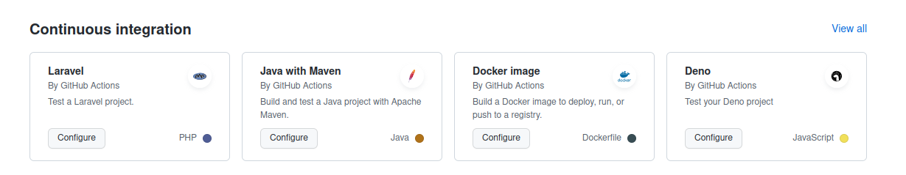

The action by default doesn't contain all the steps needed to upload the image to the Registry, so we just modify it to do as we desire.
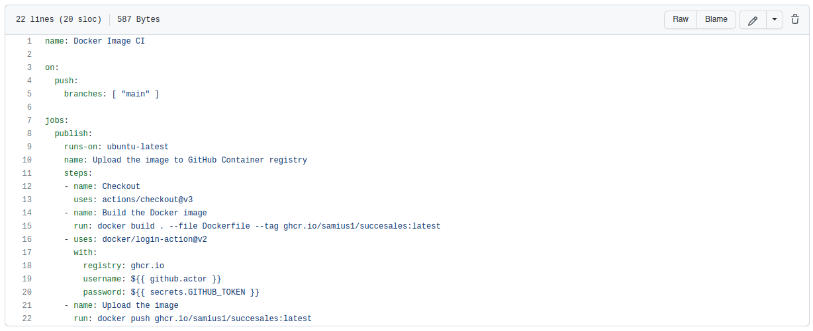

Basically, it builds the application, then logs in to the registry with our credentials and upload the image when we push to the main branch. As you can see, now we have a proper GitHub action working in place.
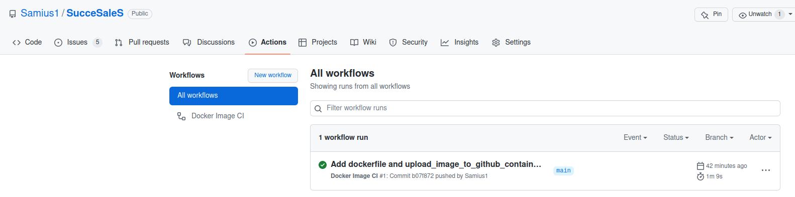

## Conclusions
Both platforms have their unique focus.
On one hand, Docker Hub automation is pretty straigh forward. With a few clicks you can have everything set in place. 
On the other hand, GitHub Container Registry requires a little bit more of set up, including repository configuration and GitHub actions.

The drawbacks of Docker Hub is that it is not free and that it has no way to give custom security permissions.
The drawbacks of GitHub Container Registry is the initial effort to configure everything. It is very time consuming and it requires to research through different topics as GitHub actions and packages.

The chosen platform to automate the process of this project is GitHub. It is the platform that stores the project itself and it has no cost associate. Even though it is extremely time consuming to set up at the beginning, it has enhanced the knowledge of GitHub actions and packaged, which will be needed in the future.
