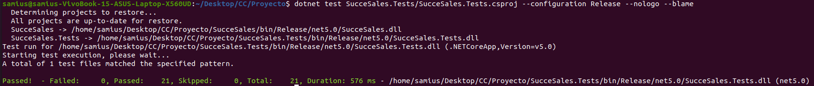

# Last milestone. End of the project
In this file, we will talk about all the technical documentation related with the project. We will start it with a motivation section and the last one will be future steps.

## Motivation
This project was born from the need to reduce waste products in this inflated times we are living. Right now, everything is more expensive than before, and reducing the waste is more important than ever.

## Microservice framework and design
When we were designing the microservice, there was a brainstorming. Should we follow the SOLID principles? The KISS one? What's the best of TDD/BDD/DDD? How are we going to handle the Dependency Injection?

* SOLID stands for **S**ingle Responsibility principle, **O**pen/closed principle, **L**iskov substition principle, **I**nterface Segregation principle and **D**ependency Inversion principle.
* KISS stands for **K**eep **It** **S**imple **S**tupid
* TDD stands for **T**est-**D**riven **D**evelopment
* BDD stands for **B**ehaviour-**D**riven **D**evelopment
* DDD stands for **D**omain **D**riven **D**evelopment

It was crystal clear that we were going to use C# as our language. It is gaining popularity step by step and I have been developing with it for 4 years at the moment, so it was the perfect chance to try to take it a little bit further. Would it be possible to create a microservice with C#? My heart said yes but my mind was not sure. Searcing over the internet, there was this [detailed article](https://raw.githubusercontent.com/dotnet-architecture/eBooks/main/current/microservices/NET-Microservices-Architecture-for-Containerized-NET-Applications.pdf) that was focus on developing a microservice on C#. It was pretty interesting and it had tons of technical documentation, so it seemed like C# is a pretty solid choice for the porpouse of both the course goal and my personal goal. 

### Arquitectural decisions
When you think about microservices, you can't help but think about encapsulated functionality and the ability to scale it easily. With this in mind, we need to design a flexible application that has higly decouple layers. This will help us in the future to proper escalate it and gives us room for improvement in case any layer is not behaving the way it is intented to.

We have tried to structure and develop the application following this decisions.
1. **KISS principle.** We are going to develop a microservice that has one single resposibility, so there is no need to complicate the project. Create one entity per layer should be enough for the porpouse of the microservice. We finally created two entities on the application layer because it could be confusing for the user having the price in a shopping list. It may make the user believe that the recommended price for that product is the one being shown, while that was not true.
We use the same function to retrieve data for the sales report and for the shopping list, instead of creating different functions, which will break the DRY principle. **D**on't **R**epeat **Y**ourself.
2. **DDD.** Domain-Driven Development is probably the best fit for any top-notch development. In this case, it was pretty obvious that DDD was our best fit. It is focused on the domain of the problem and it allows the microservice to be more focus on its main goal. Clearly, we know that TDD is also one of the best techniques, so even though we used DDD, we still tried to create the tests always before the actual code.
Retrieving the same data as we mentioned in the KISS principle, but applying different algorithm is just an example of a good domain study, as we did when we created the project.
3. **SOLID principles.** As they state, they just perfectly fit in the philosophy of the microservice: each class should have one responsibility, as the microservice should be focus on one functionality; we can extend our functionality but we should not disrupt the actual behaviour of the microservice, etc.

## Layers
Our microservice has three main layers.
1. **Application layer.** This layer can be found in the "Presentation" folder. This layer is the one responsible for reciving the initial call and trigger the process. It has almost no logic, just some syntaxtis validation in one case.
2. **Domain layer.** This layer can be found in the "Domain" folder. It is responsible for applying the domain logic to the data.
3. **Data access layer.** This layer can be found in the "Storage" folder. This layer just store and retrieve data from the database.

If the microservice were a little bit bigger, we would have considered to add a service orchestration layer to handle its dependencies between the internal services.

So as you can see, each layer has its unique focus and has its own responsibilities. This enhances the layers to be decoupled from each other, even though at the end we have some dependency injection. But since it is based on an abstraction, we could easily change the classes.

### Endpoints
There are 4 main endpoints, order by importance to the final users.
1. **GetShoppingList.** The main goal of this project is this endpoint. It shows the user what they should buy for the next day.
2. **GetSalesReport.** This endpoint helps the user to pin out what products have a better sales ratio, so they can study their actual stock to improve it.
3. **PostSale.** This endpoint allows the user to add a sale to the database. It is the main endpoint to enter data in the system, but it is not very interesting in functionality.
4. **GetSale.** The main goal of this endpoint is testing. It allows the developers to test if a sale was posted successfully or not.

### Tests
Our main focus has been to have a proper application with its proper cloud configuration. As we said before, we have been following the KISS principle, so we have created tests for each layer but just once.

The first tests to be create are the application layer ones. In this layer, we just check that the microservice returns the expected response, while we mock the calls to the domain layer.

Following the above approach, the domain layer tests are created. In this case, we make sure that the domain logic is being executed, mocking the calls to the data access layer. Those tests are pretty important. If they fail, it means our logic is not properly implemented.

Finally, in the data access layer we define a test database to execute the integration tests. These are the most critical tests, as they check if everything is in place for our application to be run.

We have a total of 20 tests, checking that each layer is working properly.

We could have created more tests like component tests, system tests and so, but they would have followed the same pattern as the created ones. Create the tests, adapt the code to pass it and fix whatever is broken.

## Distributed configuration

## Log tool

## Final testing
For the final testing, we are going to use 

## Future steps
There is some technical debt that should be address in the future to continue this project. Also, there are some improvements that would be a nice to have.
1. **Add automapper.** For this initial project, automapper was not added to the solution but it would have reduced some coupling between layers and would have made it easier to develop.
2. **Improve the algorithm to know what to buy.** Let the user decide an interval of days to make the prediction, instead of just showing the next day prediction.
3. **Improve the sales report.** Allow the user to customize it depending on some parameters.
4. **Add documentation where it is needed.** Some code may not be well documented depending on the developer perspective. Since we followed the KISS principle, we tried to focus more on the development.
5. **Deploy to Kubernetes. Use of Helm, lint the chart, etc.** It would have been nice to deploy this microservice on the cloud to a Kubernetes cluster. It would have improved the perspective of this course, broaden the knowledge of the students in this matter.
6. **Refactor the code.** Some functionality may be encapsulated to create more robust tests.
7. **Add sonarqube to the project.** This will ensure us that our project is flawless from the code perspective. 
8. **Add more testing.** It would be interesing to realize different techniques that were not used during the development of this project, as mutation testing for example. 
