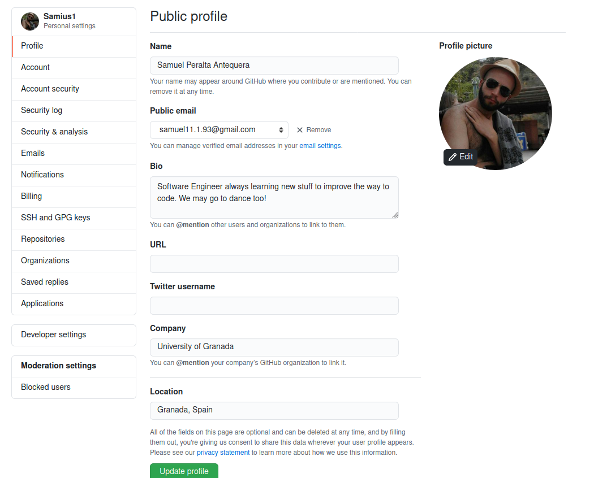
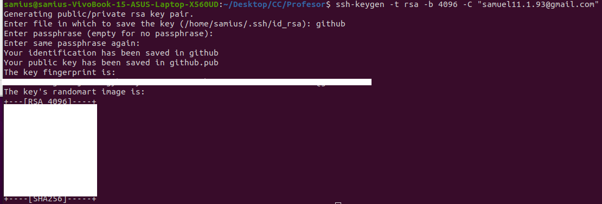
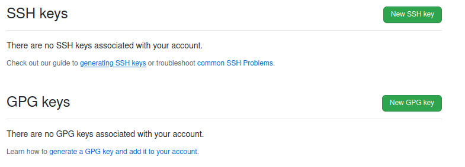
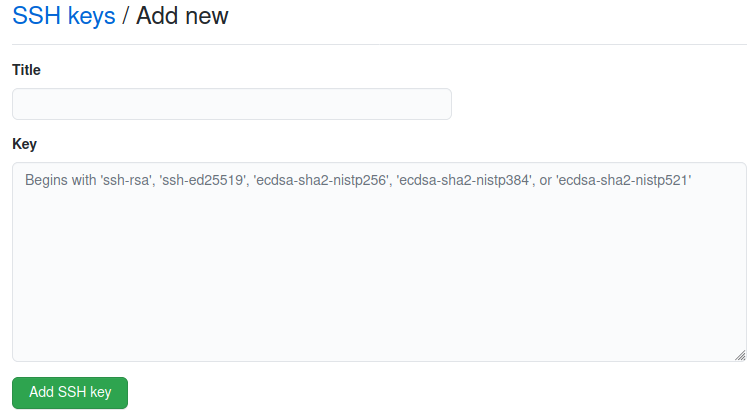
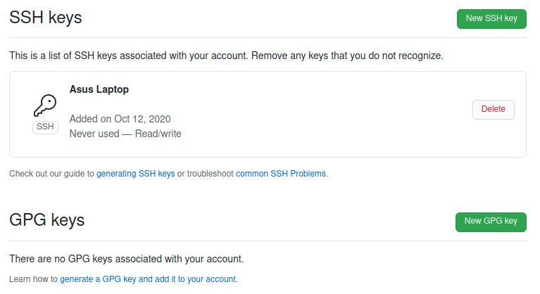
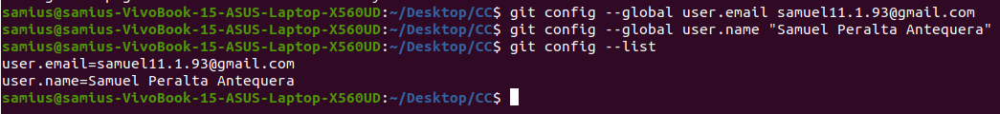
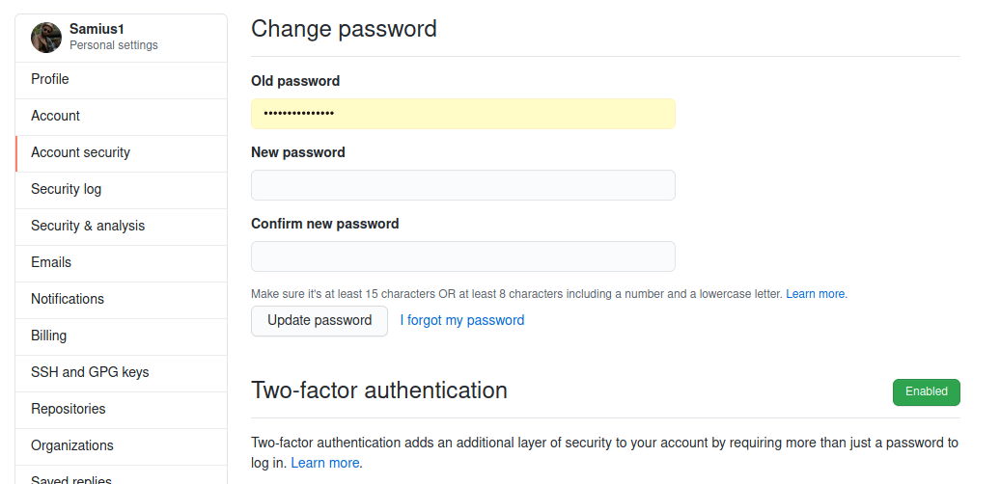
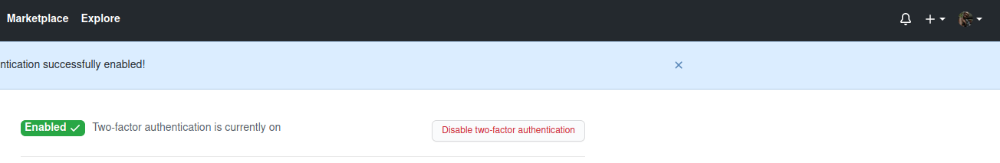

# Configuring profile
The first thing we are going to do is to make our profile more personal.  
To do this, we go to "Settings" -> "Profile". We fill the information as we desire. In my case, the profile in edit mode looks like this.   
Finally, GitHub users can see our profile like this.  
  

# Configuring GitHub to work with SSH
After installing Git, you can find tutorials all over the internet, we need to create the SSH key pair to work with GitHub.

I recommend you to follow this [tutorial](https://docs.github.com/es/free-pro-team@latest/github/authenticating-to-github/generating-a-new-ssh-key-and-adding-it-to-the-ssh-agent#generating-a-new-ssh-key) to configure this step.

To create the SSH keys, we just need to execute the following command in the command line.  
```
ssh-keygen -t rsa -b 4096 -C "samuel11.1.93@gmail.com"
```
It should appear something like this in your screen.
  

After that, we just need to go to "Settings" -> "SSH and GPG keys" and click on "New SSH keys".
 

Fill in the "Key" field with the text inside the new created SSH key file ".pub" (you can find it on the folder "~/.ssh") and select the name that you desire.
 

Now, you can see the new created key in the GitHub interface.
 

# Configuring git environment on local computer
It's time to configure our environment in our computer!  
First, we are going to configure the pull command so it always works as if rebase option is selected.  
```
git config --global pull.rebase true
```
After that, we go to the folder where we stored the [common project](https://github.com/JJ/CC-21-22) and execute the next command line.
```
git remote add upstream https://github.com/JJ/CC-21-22
```
Now we are going to configure the user name and user email, just by tiping the next command line.
```
git config --global user.email samuel11.1.93@gmail.com
git config --global user.name "Samuel Peralta Antequera"
```
Here, you can see how it should be after executing the previous lines.  
 

# Configuring extra security measures
Finally, we are adding some security to our account by enabling the two factor authentication. To configure it, we need to go to "Settings" -> "Account security".
 

Here, we click on "Enabled" to start the process. In my case, I selected to enable it through an app in my mobile phone. I use the "Authenticator" app, so you just have to follow the instructions to enable it.  
After following the instructions, you get the next successful message.  
 

